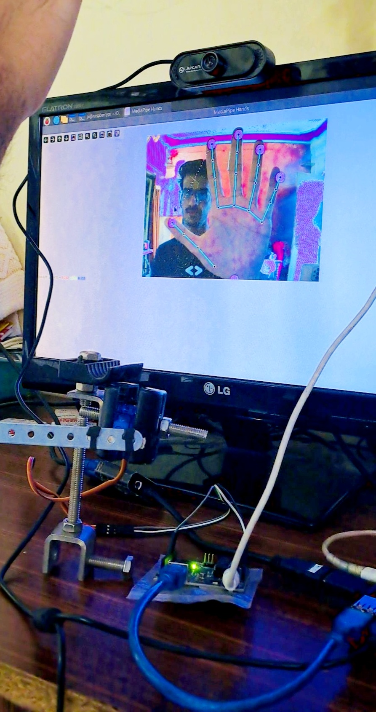
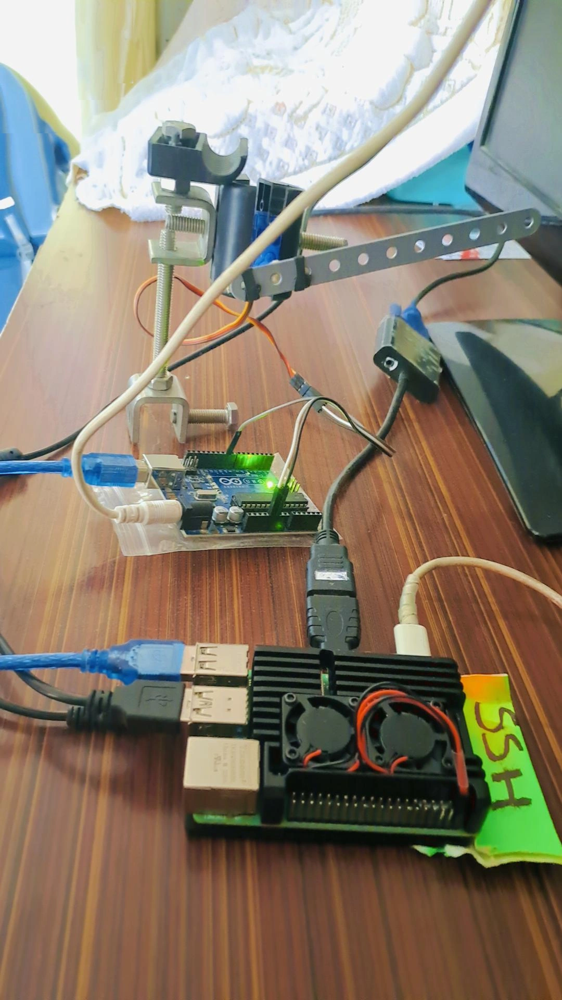
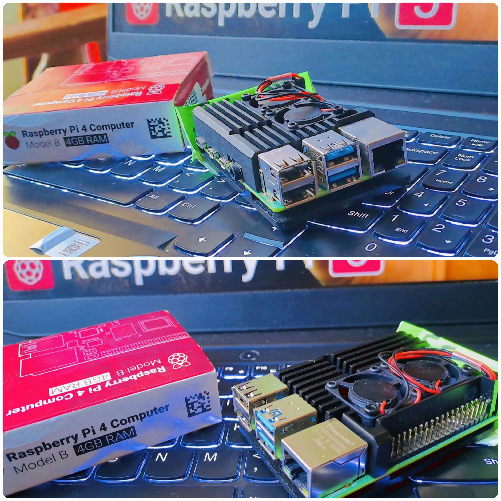

# Servo Motor Control Using Hand Gesture

This project enables servo motor control through hand gestures using computer vision and ESP32. Leveraging edge computing, AI-powered computer vision, and robotics, this setup captures hand gestures through a camera and interprets the angle of the thumb and index finger to control the servo motor.

<div align="center">
    <video width="640" height="360" controls>
  <source src="Images/VID_38560221_232925_964.mp4" type="video/mp4">
  Your browser does not support the video tag.
</video>
</div>

        

## Table of Contents
- [Features](#features)
- [Requirements](#requirements)
- [Installation](#installation)
- [Hardware Setup](#hardware-setup)
- [Running the Program](#running-the-program)
- [Usage](#usage)
- [License](#license)

## Features
- Gesture-based control of a servo motor
- Real-time angle detection of thumb and index finger using computer vision
- ESP32-based implementation for wireless control
- Two implementation options:
  - Arduino-based setup (Arduino folder)
  - ESP32-based setup (ESP32 folder)

## Requirements
### Hardware
- **ESP32** or **Arduino** (based on your preferred implementation)
- **Servo Motor**
- **Camera** (webcam or USB camera)
- **Connecting wires**

### Software
- **Python 3.x**
- **Arduino IDE** (for flashing code to ESP32/Arduino)
- **Libraries**: 
  - OpenCV (for hand gesture recognition)
  - Mediapipe (for computer vision)
  - Required Python packages (specified in each implementation's requirements)

## Installation

### 1. Clone the Repository
```bash
git clone https://github.com/yourusername/Servo-Motor-Control-using-Hand-Gesture.git
cd Servo-Motor-Control-using-Hand-Gesture
```

### 2. Choose Your Implementation
The project provides two implementation options:

#### Arduino Implementation
Navigate to the Arduino folder:
```bash
cd Arduino
```
Follow the setup instructions in the Arduino implementation's app.py file.

#### ESP32 Implementation
Navigate to the ESP32 folder:
```bash
cd Esp32
```
1. Flash the `servoMotorCode.ino` to your ESP32 using Arduino IDE
2. Set up the Python environment and run app.py

### Hardware Setup
#### For ESP32:
- Connect the Servo Motor to the ESP32:
  - Signal wire to designated GPIO pin (specified in the code)
  - Power (Red wire) to 5V
  - Ground (Black wire) to GND
- Ensure your camera is connected to your computer

#### For Arduino:
- Connect the Servo Motor to the Arduino:
  - Signal wire to the designated pin (specified in the code)
  - Power (Red wire) to 5V
  - Ground (Black wire) to GND
- Connect your camera to the computer

### Running the Program
1. Ensure your hardware is properly connected
2. Run the appropriate Python script based on your implementation:

For Arduino:
```bash
python Arduino/app.py
```

For ESP32:
```bash
python Esp32/app.py
```

## Usage
1. Make sure your camera has a clear view of your hand
2. Use your thumb and index finger to create an angle
3. The servo motor will rotate according to the angle formed by your fingers
4. The program will display the detected hand landmarks and angle in real-time

## License
This project is licensed under the terms included in the LICENSE file.
