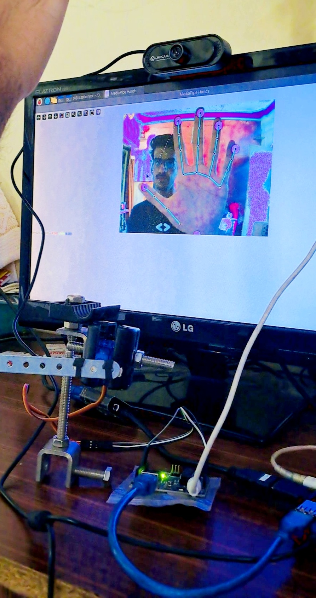
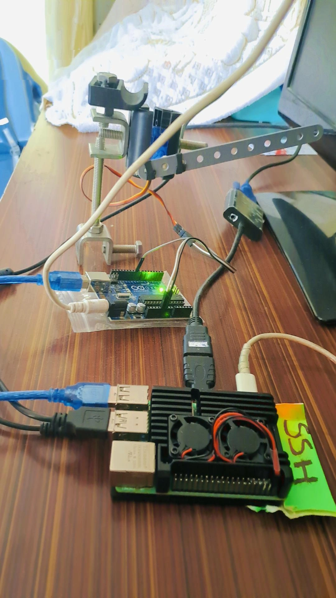
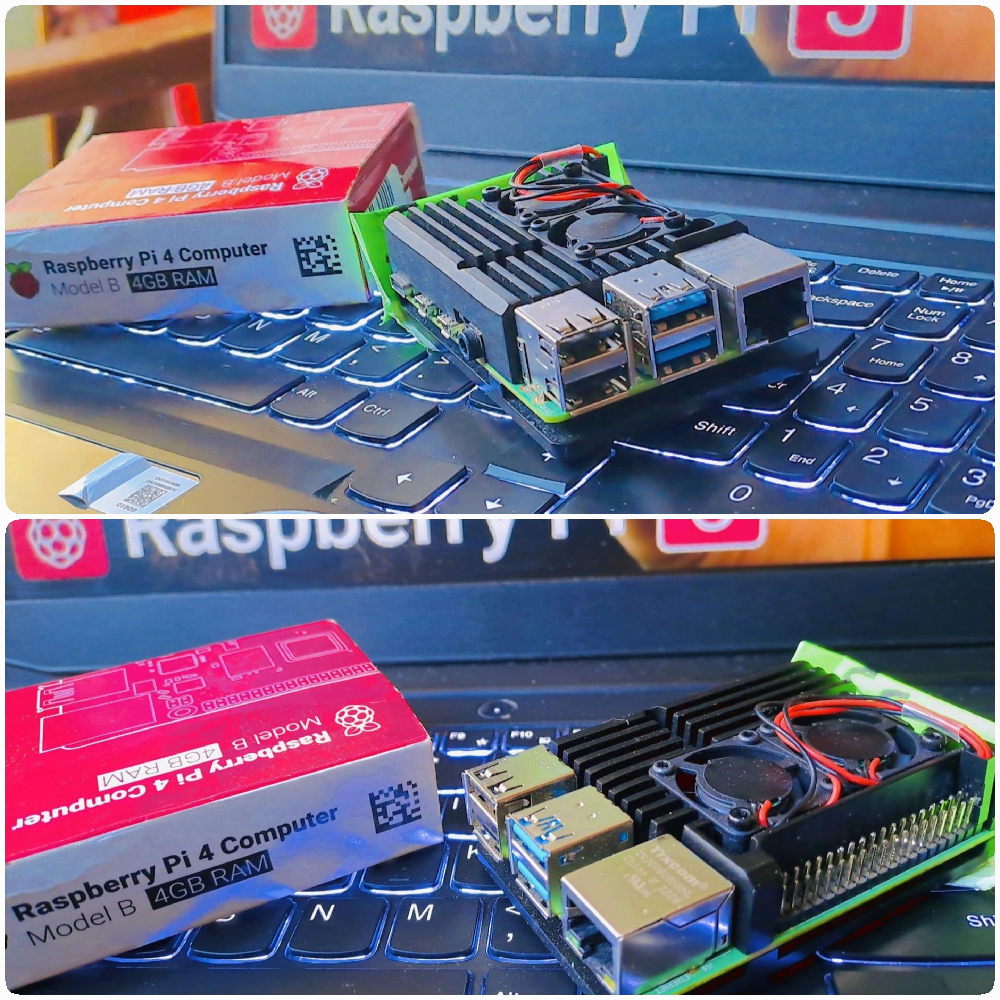

# Servo Motor Control Using Hand Gesture

This project enables servo motor control through hand gestures using a Raspberry Pi, Arduino, and an external camera. Leveraging edge computing, AI-powered computer vision, and robotics, this setup captures hand gestures and interprets the angle of the thumb and index finger to control the servo motor.


<div align="center">
    <video width="640" height="360" controls>
  <source src="images/
" type="video/mp4">
  Your browser does not support the video tag.
</video>
</div>

        

#### Live Demo
<video width="640" height="360" controls>
  <source src="Images/VID_38560221_232925_964.mp4">
  Your browser does not support the video tag.
</video>


## Table of Contents
- [Features](#features)
- [Requirements](#requirements)
- [Installation](#installation)
- [Hardware Setup](#hardware-setup)
- [Running the Program](#running-the-program)
- [Usage](#usage)
- [Troubleshooting](#troubleshooting)
- [Contributing](#contributing)
- [License](#license)

## Features
- Gesture-based control of a servo motor.
- Real-time angle detection of thumb and index finger using computer vision.
- Edge computing with Raspberry Pi for smooth operation without needing a powerful computer.

## Requirements
### Hardware
- **Raspberry Pi** (preferably Raspberry Pi 4)
- **Arduino** (e.g., Arduino Uno)
- **Servo Motor**
- **Camera Module** (compatible with Raspberry Pi)
- **Connecting wires**

### Software
- **Python 3.10**
- **Arduino IDE** (for flashing code onto the Arduino)
- **Libraries**: 
  - OpenCV (for hand gesture recognition)
  - PyFirmata2 (for Arduino communication with Python)
  - Serial (for communication with Arduino)
  - Mediapipe (for computer vision)

## Installation

### 1. Clone the Repository
```bash
git clone https://github.com/yourusername/hand-gesture-servo-control.git
cd hand-gesture-servo-control
```
### 2. Set Up Python Environment
- **Install Python 3.10 if not already installed on your system.**
- **Create a virtual environment:**
```bash
python3.10 -m venv gesture
source gesture/bin/activate  # For Linux
gesture\Scripts\activate     # For Windows
```

### 3. Set Up the Arduino
- **Connect the Arduino to your Raspberry Pi or local system via USB.**
- **Flash the StandardFirmata firmware onto the Arduino:**
  - Open the Arduino IDE.
  - Go to File > Examples > Firmata > StandardFirmata.
  - Select the correct board and port.
  - Click Upload.

### 4. Check Serial Port
- **On Linux, check the port of the connected Arduino (usually /dev/ttyUSB0 or /dev/ttyACM0) with:**
```bash
ls /dev/tty*
```
- **Update the port name in Hand_gesture.py accordingly.**

### Hardware Setup
- **1. Connect the Servo Motor to the Arduino:**
  -Signal (Yellow/White wire) to Pin 9 on Arduino.
  -Power (Red wire) to 5V on Arduino.
  -Ground (Black wire) to GND on Arduino.
- **Connect the Camera to the Raspberry Pi or attach a USB camera.**
- **Connect the Arduino to the Raspberry Pi using a USB cable.**

### Running the Program
- **Activate the Python environment if not already activated:**
```bash
source gesture/bin/activate  # For Linux
```
- **Run the program:**
```bash
python Hand_gesture.py
```

### Usage
- **1. Hold your hand in front of the camera.**
- **2. The camera will capture the angle between your thumb and index finger.**
- **3. The servo motor will rotate based on the detected angle.**

### Troubleshooting
- **SerialException: Could not open port: Ensure the correct port is specified in Hand_gesture.py for the Arduino.**
- **TypeError: Not a code object: This may be due to an incompatible Python version. Downgrade to Python 3.10 if using Python 3.11 or higher.**
- **Servo not responding: Double-check the wiring and make sure the Arduino firmware is uploaded correctly.**

### Contributing
- **Contributions are welcome! Please fork this repository and submit a pull request for review.**

## License

This project is licensed under the **GNU General Public License v3.0** (GPL v3).

**GPL v3** is a free, copyleft license for software. It guarantees end users the freedom to run, study, share, and modify the software. It also ensures that derivative works must also be licensed under the same terms, ensuring that the code remains open source. You can read more about the license [here](https://www.gnu.org/licenses/gpl-3.0.en.html).
